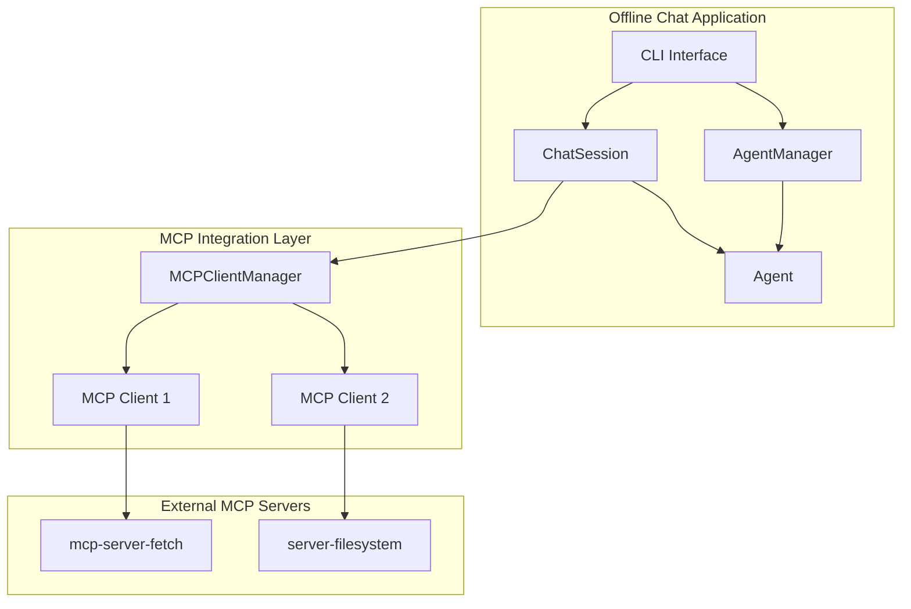

# Design Document: MCP Server Integration

## Overview

This design adds Model Context Protocol (MCP) server integration to the Offline Chat application. MCP servers provide external tools that agents can use during conversations, enabling capabilities like web fetching, filesystem access, and other external integrations.

The implementation uses the official MCP Python SDK (`mcp` package) to connect to MCP servers via stdio transport, discover their tools, and execute tool calls during agent conversations.

## Architecture



## Components and Interfaces

### MCPServerConfig

Configuration for a single MCP server.

```python
@dataclass
class MCPServerConfig:
    """Configuration for an MCP server.
    
    Attributes:
        name: Unique identifier for this server configuration.
        command: The command to execute (e.g., "uvx", "npx").
        args: List of arguments to pass to the command.
        env: Optional environment variables for the server process.
        disabled: Whether this server is disabled.
    """
    name: str
    command: str
    args: list[str]
    env: dict[str, str] = field(default_factory=dict)
    disabled: bool = False
    
    def to_dict(self) -> dict[str, Any]:
        """Serialize to dictionary."""
        ...
    
    @classmethod
    def from_dict(cls, data: dict[str, Any]) -> "MCPServerConfig":
        """Deserialize from dictionary."""
        ...
```

### MCPClient

Manages connection to a single MCP server.

```python
class MCPClient:
    """Client for connecting to and communicating with an MCP server.
    
    Uses stdio transport to communicate with the server process.
    Implements async context manager protocol for resource management.
    
    Attributes:
        config: The server configuration.
        session: The MCP ClientSession (set after connect).
        tools: List of available tools from this server.
    """
    
    def __init__(self, config: MCPServerConfig):
        """Initialize with server configuration."""
        ...
    
    async def __aenter__(self) -> "MCPClient":
        """Connect to the MCP server."""
        ...
    
    async def __aexit__(self, exc_type, exc_val, exc_tb) -> None:
        """Disconnect from the MCP server."""
        ...
    
    async def connect(self) -> bool:
        """Establish connection to the MCP server.
        
        Returns:
            True if connection successful, False otherwise.
        """
        ...
    
    async def disconnect(self) -> None:
        """Close the connection to the MCP server."""
        ...
    
    async def list_tools(self) -> list[dict[str, Any]]:
        """Get available tools from the server.
        
        Returns:
            List of tool schemas in Ollama-compatible format.
        """
        ...
    
    async def call_tool(self, name: str, arguments: dict[str, Any]) -> str:
        """Execute a tool on the server.
        
        Args:
            name: The tool name.
            arguments: Tool arguments.
            
        Returns:
            Tool execution result as string.
        """
        ...
```

### MCPClientManager

Manages multiple MCP server connections for an agent.

```python
class MCPClientManager:
    """Manages connections to multiple MCP servers.
    
    Handles connecting to all configured servers, aggregating tools,
    and routing tool calls to the appropriate server.
    
    Attributes:
        configs: List of MCP server configurations.
        clients: Dictionary mapping server names to connected clients.
        tool_registry: Dictionary mapping tool names to server names.
    """
    
    def __init__(self, configs: list[MCPServerConfig]):
        """Initialize with server configurations."""
        ...
    
    async def __aenter__(self) -> "MCPClientManager":
        """Connect to all configured MCP servers."""
        ...
    
    async def __aexit__(self, exc_type, exc_val, exc_tb) -> None:
        """Disconnect from all MCP servers."""
        ...
    
    async def connect_all(self) -> None:
        """Connect to all enabled MCP servers.
        
        Logs errors for servers that fail to connect but continues
        with remaining servers.
        """
        ...
    
    async def disconnect_all(self) -> None:
        """Disconnect from all connected MCP servers."""
        ...
    
    def get_all_tools(self) -> list[dict[str, Any]]:
        """Get combined tools from all connected servers.
        
        Returns:
            List of all tool schemas in Ollama-compatible format.
        """
        ...
    
    async def call_tool(self, name: str, arguments: dict[str, Any]) -> str:
        """Route and execute a tool call.
        
        Args:
            name: The tool name.
            arguments: Tool arguments.
            
        Returns:
            Tool execution result.
            
        Raises:
            ValueError: If tool not found in any connected server.
        """
        ...
```

### Updated Agent Class

Extended to support MCP server configuration.

```python
@dataclass
class Agent:
    # ... existing fields ...
    mcp_servers: list[MCPServerConfig] = field(default_factory=list)
    
    def to_dict(self) -> dict[str, Any]:
        """Serialize agent including MCP configs."""
        data = {
            # ... existing fields ...
            "mcp_servers": [s.to_dict() for s in self.mcp_servers],
        }
        return data
    
    @classmethod
    def from_dict(cls, data: dict[str, Any]) -> "Agent":
        """Deserialize agent including MCP configs."""
        mcp_servers = [
            MCPServerConfig.from_dict(s) 
            for s in data.get("mcp_servers", [])
        ]
        return cls(
            # ... existing fields ...
            mcp_servers=mcp_servers,
        )
```

### Updated ChatSession Class

Extended to use MCP tools during conversations.

```python
class ChatSession:
    def __init__(
        self,
        manager: AgentManager,
        history_store: Optional[HistoryStore] = None,
        tools: Optional[list] = None,
    ):
        # ... existing initialization ...
        self._mcp_manager: Optional[MCPClientManager] = None
    
    async def start_async(self, agent_name: str) -> bool:
        """Start session with async MCP server connections.
        
        Args:
            agent_name: The agent to start session with.
            
        Returns:
            True if session started successfully.
        """
        ...
    
    async def end_async(self) -> None:
        """End session and disconnect MCP servers."""
        ...
    
    def _get_tools(self) -> list[dict[str, Any]]:
        """Get tools including MCP tools."""
        tools = []
        
        # Add MCP tools if available
        if self._mcp_manager:
            tools.extend(self._mcp_manager.get_all_tools())
        
        # Add existing web search tools if enabled
        if self.agent and self.agent.web_search_enabled:
            # ... existing web search tool logic ...
            pass
        
        return tools
    
    async def _execute_tool_async(
        self, name: str, arguments: dict[str, Any]
    ) -> str:
        """Execute tool, routing to MCP or built-in handlers."""
        # Check MCP tools first
        if self._mcp_manager and name in self._mcp_manager.tool_registry:
            return await self._mcp_manager.call_tool(name, arguments)
        
        # Fall back to built-in tools
        return self._execute_tool(name, arguments)
```

## Data Models

### Agent Configuration with MCP Servers

```json
{
  "name": "research-assistant",
  "display_name": "Research Assistant",
  "base_model": "llama3:latest",
  "system_prompt": "You are a helpful research assistant...",
  "temperature": 0.7,
  "language": "English",
  "web_search_enabled": false,
  "mcp_servers": [
    {
      "name": "fetch",
      "command": "uvx",
      "args": ["mcp-server-fetch"],
      "env": {},
      "disabled": false
    },
    {
      "name": "filesystem",
      "command": "npx",
      "args": ["-y", "@modelcontextprotocol/server-filesystem", "/Users/user/documents"],
      "env": {},
      "disabled": false
    }
  ],
  "created_at": "2025-01-14T10:00:00"
}
```

### MCP Tool Schema Conversion

MCP tools are converted to Ollama-compatible format:

```python
def convert_mcp_tool_to_ollama(mcp_tool) -> dict[str, Any]:
    """Convert MCP tool schema to Ollama format.
    
    Args:
        mcp_tool: Tool object from MCP server.
        
    Returns:
        Ollama-compatible tool schema.
    """
    return {
        "type": "function",
        "function": {
            "name": mcp_tool.name,
            "description": mcp_tool.description or "",
            "parameters": mcp_tool.inputSchema or {
                "type": "object",
                "properties": {},
                "required": []
            }
        }
    }
```

## Correctness Properties

*A property is a characteristic or behavior that should hold true across all valid executions of a system—essentially, a formal statement about what the system should do. Properties serve as the bridge between human-readable specifications and machine-verifiable correctness guarantees.*

### Property 1: MCP Server Configuration Round Trip

*For any* valid MCPServerConfig object with name, command, args, optional env vars, and disabled flag, serializing to dictionary and deserializing back SHALL produce an equivalent configuration object with all fields preserved.

**Validates: Requirements 1.1, 1.2, 1.3, 1.4**

### Property 2: Agent Configuration Round Trip with MCP Servers

*For any* valid Agent object containing zero or more MCP server configurations, serializing to dictionary and deserializing back SHALL produce an equivalent Agent with equivalent MCP configurations.

**Validates: Requirements 1.4**

### Property 3: Tool Aggregation Completeness

*For any* set of MCP servers with known tool lists, when all servers are connected, the combined tools list SHALL contain exactly all tools from all connected servers.

**Validates: Requirements 3.1, 3.3**

### Property 4: Schema Conversion Validity

*For any* MCP tool with name, description, and input schema, converting to Ollama format SHALL produce a valid tool schema containing the function type, name, description, and parameters.

**Validates: Requirements 3.2**

### Property 5: Tool Routing Correctness

*For any* tool call where the tool name exists in the tool registry, the call SHALL be routed to the server that originally registered that tool name.

**Validates: Requirements 3.4, 4.1**

### Property 6: Backward Compatibility - Empty MCP Config

*For any* agent configuration dictionary that does not contain an `mcp_servers` field, deserializing SHALL result in an agent with an empty MCP servers list (not None, not error).

**Validates: Requirements 6.1**

### Property 7: MCP Config Validation

*For any* MCPServerConfig, the name field SHALL be non-empty, the command field SHALL be non-empty, and the args field SHALL be a list (possibly empty).

**Validates: Requirements 5.4**

## Error Handling

### Connection Errors

- **Server not found**: Log error, continue without server's tools
- **Connection timeout**: Log error, continue without server's tools  
- **Server crash during session**: Log error, remove server from active clients

### Tool Execution Errors

- **Tool not found**: Return error message to agent
- **Tool execution failure**: Return error message with details to agent
- **Timeout**: Return timeout error message to agent

### Configuration Errors

- **Invalid command**: Raise validation error during agent creation
- **Missing required fields**: Raise validation error during deserialization

## Testing Strategy

### Unit Tests

- MCPServerConfig serialization/deserialization edge cases
- Agent serialization with various MCP config combinations
- Tool schema conversion for different input types
- Tool registry management with duplicate tool names
- Error handling for invalid configurations
- Graceful degradation when servers fail to connect

### Property-Based Tests

Using `hypothesis` for property-based testing:

- **Property 1**: Generate random MCPServerConfig objects with varying fields, verify round-trip preserves all data
- **Property 2**: Generate random Agent objects with 0-5 MCP configs, verify round-trip
- **Property 3**: Generate random tool lists for multiple mock servers, verify aggregation completeness
- **Property 4**: Generate random MCP tool schemas, verify Ollama conversion produces valid schemas
- **Property 5**: Generate tool calls with registered tool names, verify routing to correct server
- **Property 6**: Generate agent config dicts without mcp_servers field, verify empty list default
- **Property 7**: Generate MCPServerConfig objects, verify validation catches invalid configs

### Integration Tests

- Connect to real MCP server (mcp-server-fetch)
- Execute tool calls through full pipeline
- Verify graceful handling of server failures
- Test session lifecycle with MCP servers

### Test Configuration

- Property tests: minimum 100 iterations per property
- Use `pytest` with `pytest-asyncio` for async tests
- Use `hypothesis` for property-based test generation
- Mock MCP servers for unit tests where appropriate
- Tag format: **Feature: mcp-integration, Property N: [property description]**
