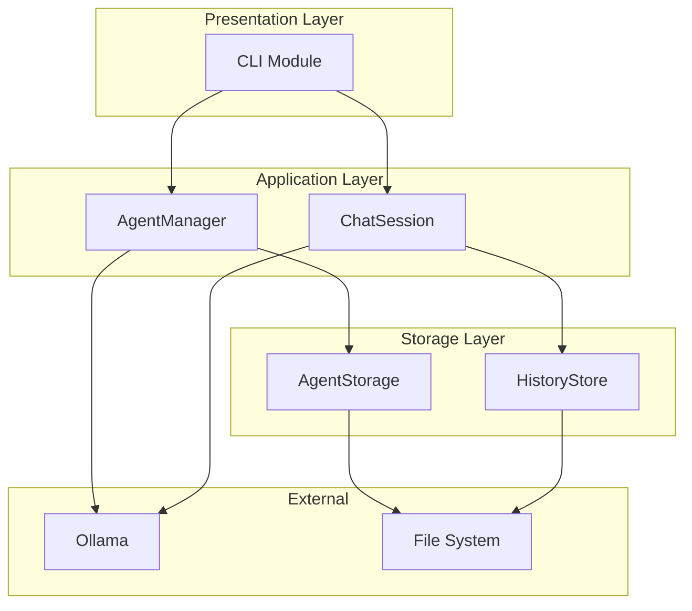

# Design Document: Offline Chat

## Overview

Offline Chat is a terminal-based chatbot application that leverages local Ollama models to provide personalized AI agent interactions. The system follows a modular architecture separating concerns into agent management, chat sessions, storage, and CLI presentation layers. This design enables both standalone CLI usage and library integration for programmatic access.

The application uses Ollama's Modelfile system to create customized agents with specific personas, and maintains persistent conversation history in JSON format for context continuity across sessions.

## Architecture



### Layer Responsibilities

- **Presentation Layer**: Handles terminal UI, user input/output, menu navigation
- **Application Layer**: Contains business logic for agent management and chat sessions
- **Storage Layer**: Manages persistence of agent configurations and conversation history
- **External**: Ollama for model execution, file system for data storage

## Components and Interfaces

### Agent Module

```python
from dataclasses import dataclass, field
from datetime import datetime
from typing import Optional
import re

@dataclass
class Agent:
    """Represents an AI agent configuration."""
    name: str                           # Unique identifier (kebab-case)
    display_name: str                   # Human-readable name
    base_model: str                     # Ollama base model (e.g., "llama3:latest")
    system_prompt: str                  # Persona and purpose definition
    temperature: float = 0.7            # Response creativity (0.0-1.0)
    created_at: datetime = field(default_factory=datetime.now)
    
    def validate_name(self) -> bool:
        """Validate agent name follows kebab-case pattern."""
        pattern = r'^[a-z0-9]+(-[a-z0-9]+)*$'
        return bool(re.match(pattern, self.name))
    
    def to_modelfile(self) -> str:
        """Generate Ollama Modelfile content."""
        return f'''FROM {self.base_model}

SYSTEM "{self.system_prompt}"

PARAMETER temperature {self.temperature}
'''
    
    def to_dict(self) -> dict:
        """Serialize agent to dictionary."""
        return {
            "name": self.name,
            "display_name": self.display_name,
            "base_model": self.base_model,
            "system_prompt": self.system_prompt,
            "temperature": self.temperature,
            "created_at": self.created_at.isoformat()
        }
    
    @classmethod
    def from_dict(cls, data: dict) -> "Agent":
        """Deserialize agent from dictionary."""
        return cls(
            name=data["name"],
            display_name=data["display_name"],
            base_model=data["base_model"],
            system_prompt=data["system_prompt"],
            temperature=data.get("temperature", 0.7),
            created_at=datetime.fromisoformat(data["created_at"])
        )
```

### AgentManager Interface

```python
from typing import Protocol, Optional
from pathlib import Path

class AgentManagerProtocol(Protocol):
    """Protocol for agent management operations."""
    
    def create_agent(self, agent: Agent) -> bool:
        """Create a new agent with Ollama model registration."""
        ...
    
    def list_agents(self) -> list[Agent]:
        """List all available agents."""
        ...
    
    def get_agent(self, name: str) -> Optional[Agent]:
        """Get a specific agent by name."""
        ...
    
    def delete_agent(self, name: str) -> bool:
        """Delete an agent and its associated data."""
        ...
    
    def agent_exists(self, name: str) -> bool:
        """Check if an agent exists."""
        ...
```

### ChatSession Interface

```python
from typing import Protocol, Iterator, Callable

class ChatSessionProtocol(Protocol):
    """Protocol for chat session operations."""
    
    def start(self, agent_name: str) -> bool:
        """Start a chat session with the specified agent."""
        ...
    
    def send_message(self, content: str) -> Iterator[str]:
        """Send a message and yield response chunks."""
        ...
    
    def clear_history(self) -> None:
        """Clear the conversation history."""
        ...
    
    def end(self) -> None:
        """End the session and save history."""
        ...
```

### HistoryStore Interface

```python
from typing import Protocol
from dataclasses import dataclass
from datetime import datetime

@dataclass
class Message:
    """Represents a single message in conversation history."""
    role: str           # "user" or "assistant"
    content: str        # Message content
    timestamp: datetime # When the message was sent

@dataclass
class ConversationHistory:
    """Represents the full conversation history for an agent."""
    agent_name: str
    messages: list[Message]
    last_updated: datetime

class HistoryStoreProtocol(Protocol):
    """Protocol for conversation history persistence."""
    
    def load(self, agent_name: str) -> ConversationHistory:
        """Load conversation history for an agent."""
        ...
    
    def save(self, history: ConversationHistory) -> None:
        """Save conversation history."""
        ...
    
    def delete(self, agent_name: str) -> None:
        """Delete conversation history for an agent."""
        ...
```

### CLI Interface

```python
from typing import Protocol

class CLIProtocol(Protocol):
    """Protocol for CLI operations."""
    
    def run(self) -> None:
        """Start the CLI application."""
        ...
    
    def display_menu(self) -> int:
        """Display main menu and return selected option."""
        ...
    
    def create_agent_flow(self) -> None:
        """Handle agent creation workflow."""
        ...
    
    def list_agents_flow(self) -> None:
        """Handle agent listing workflow."""
        ...
    
    def chat_flow(self) -> None:
        """Handle chat session workflow."""
        ...
    
    def delete_agent_flow(self) -> None:
        """Handle agent deletion workflow."""
        ...
```

## Data Models

### Agent Configuration (config.json)

```json
{
  "name": "german-tutor",
  "display_name": "German Language Tutor",
  "base_model": "llama3:latest",
  "system_prompt": "You are a friendly German language tutor...",
  "temperature": 0.7,
  "created_at": "2025-01-13T10:00:00Z"
}
```

### Modelfile Format

```
FROM llama3:latest

SYSTEM "You are a friendly German language tutor. Help users learn German through conversation, correct their mistakes gently, and explain grammar rules when asked."

PARAMETER temperature 0.7
```

### Conversation History (history.json)

```json
{
  "agent_name": "german-tutor",
  "messages": [
    {
      "role": "user",
      "content": "How do I say hello?",
      "timestamp": "2025-01-13T10:30:00Z"
    },
    {
      "role": "assistant",
      "content": "In German, you say 'Hallo' for a casual greeting...",
      "timestamp": "2025-01-13T10:30:05Z"
    }
  ],
  "last_updated": "2025-01-13T10:30:05Z"
}
```

### Directory Structure

```
offline-chat/
├── main.py                    # Entry point
├── pyproject.toml             # Package configuration
├── Makefile                   # Build tasks
├── offline_chat/              # Main package
│   ├── __init__.py            # Package exports
│   ├── agent.py               # Agent dataclass
│   ├── manager.py             # AgentManager implementation
│   ├── session.py             # ChatSession implementation
│   ├── history.py             # HistoryStore implementation
│   ├── cli.py                 # CLI implementation
│   └── exceptions.py          # Custom exceptions
├── data/                      # Runtime data (gitignored)
│   ├── agents/                # Agent configurations
│   │   └── {agent_name}/
│   │       ├── config.json
│   │       └── Modelfile
│   └── history/               # Conversation histories
│       └── {agent_name}.json
└── tests/                     # Test suite
    ├── __init__.py
    ├── test_agent.py
    ├── test_manager.py
    ├── test_session.py
    └── test_history.py
```


## Correctness Properties

*A property is a characteristic or behavior that should hold true across all valid executions of a system—essentially, a formal statement about what the system should do. Properties serve as the bridge between human-readable specifications and machine-verifiable correctness guarantees.*

### Property 1: Agent Name Validation

*For any* string input as an agent name, the validation function SHALL accept only strings matching the pattern `^[a-z0-9]+(-[a-z0-9]+)*$` (lowercase letters, numbers, and hyphens, not starting or ending with hyphen).

**Validates: Requirements 1.2**

### Property 2: Agent Uniqueness Constraint

*For any* agent that has been successfully created, attempting to create another agent with the same name SHALL fail and the original agent SHALL remain unchanged.

**Validates: Requirements 1.3**

### Property 3: Agent Serialization Round-Trip

*For any* valid Agent object, serializing it to JSON (to_dict) and then deserializing (from_dict) SHALL produce an equivalent Agent object with all fields preserved.

**Validates: Requirements 1.4, 2.1**

### Property 4: Modelfile Generation Correctness

*For any* valid Agent configuration, the generated Modelfile SHALL contain:
- A FROM directive with the base_model value
- A SYSTEM directive with the system_prompt value
- A PARAMETER temperature directive with the temperature value

**Validates: Requirements 1.4**

### Property 5: Message Persistence

*For any* message sent during a chat session (user or assistant), after the session ends and history is saved, loading the history SHALL contain that message with correct role, content, and timestamp.

**Validates: Requirements 3.2, 3.4, 5.1, 5.2**

### Property 6: History Clear Resets State

*For any* conversation history with one or more messages, after calling clear, the history SHALL contain zero messages.

**Validates: Requirements 3.6**

### Property 7: Agent Deletion Completeness

*For any* agent that is successfully deleted, the agent directory (data/agents/{name}/) SHALL not exist AND the history file (data/history/{name}.json) SHALL not exist AND listing agents SHALL not include that agent.

**Validates: Requirements 4.3, 4.4**

### Property 8: History Serialization Round-Trip

*For any* valid ConversationHistory object, saving it to JSON and then loading it SHALL produce an equivalent ConversationHistory with all messages, timestamps, and metadata preserved.

**Validates: Requirements 5.1, 5.2, 5.3**

### Property 9: Message Display Formatting

*For any* message to be displayed, user messages SHALL be prefixed with "You:" and assistant messages SHALL be prefixed with the agent's display name followed by ":".

**Validates: Requirements 6.3, 6.4**

## Error Handling

### Custom Exceptions

```python
class OfflineChatError(Exception):
    """Base exception for Offline Chat errors."""
    pass

class AgentNotFoundError(OfflineChatError):
    """Raised when an agent does not exist."""
    def __init__(self, name: str):
        self.name = name
        super().__init__(f"Agent '{name}' not found. Use 'list' to see available agents.")

class AgentExistsError(OfflineChatError):
    """Raised when attempting to create an agent that already exists."""
    def __init__(self, name: str):
        self.name = name
        super().__init__(f"Agent '{name}' already exists.")

class InvalidAgentNameError(OfflineChatError):
    """Raised when agent name is invalid."""
    def __init__(self, name: str):
        self.name = name
        super().__init__(f"Invalid agent name '{name}'. Use lowercase letters, numbers, and hyphens only.")

class OllamaConnectionError(OfflineChatError):
    """Raised when Ollama is not reachable."""
    def __init__(self):
        super().__init__("Cannot connect to Ollama. Is it running?")

class OllamaCommandError(OfflineChatError):
    """Raised when an Ollama command fails."""
    def __init__(self, command: str, error: str):
        self.command = command
        self.error = error
        super().__init__(f"Ollama command failed: {error}")
```

### Error Handling Strategy

| Error Scenario | Handler | User Message |
|----------------|---------|--------------|
| Invalid agent name | InvalidAgentNameError | "Invalid agent name. Use lowercase letters, numbers, and hyphens only." |
| Agent already exists | AgentExistsError | "Agent '{name}' already exists." |
| Agent not found | AgentNotFoundError | "Agent '{name}' not found. Use 'list' to see available agents." |
| Ollama not running | OllamaConnectionError | "Cannot connect to Ollama. Is it running?" |
| Ollama command fails | OllamaCommandError | Display the specific error from Ollama |
| Ctrl+C interrupt | KeyboardInterrupt | Save pending data, display "Goodbye!" |
| File I/O error | IOError | "Error accessing data files. Check permissions." |

## Testing Strategy

### Testing Framework

- **Unit Testing**: pytest
- **Property-Based Testing**: hypothesis
- **Test Configuration**: Minimum 100 iterations per property test

### Dual Testing Approach

The testing strategy employs both unit tests and property-based tests:

- **Unit tests**: Verify specific examples, edge cases, and error conditions
- **Property tests**: Verify universal properties across randomly generated inputs

### Test Structure

```
tests/
├── __init__.py
├── conftest.py              # Shared fixtures
├── test_agent.py            # Agent dataclass tests
├── test_manager.py          # AgentManager tests
├── test_session.py          # ChatSession tests
├── test_history.py          # HistoryStore tests
└── test_cli.py              # CLI tests
```

### Property Test Annotations

Each property test must be annotated with the design property it validates:

```python
from hypothesis import given, strategies as st, settings

@settings(max_examples=100)
@given(name=st.text())
def test_agent_name_validation_property(name: str):
    """
    Feature: offline-chat, Property 1: Agent Name Validation
    Validates: Requirements 1.2
    """
    # Test implementation
```

### Test Categories

| Category | Test Type | Coverage |
|----------|-----------|----------|
| Agent name validation | Property | All string inputs |
| Agent serialization | Property | All valid Agent objects |
| Modelfile generation | Property | All valid Agent configs |
| History persistence | Property | All message sequences |
| History round-trip | Property | All ConversationHistory objects |
| Error handling | Unit | Specific error scenarios |
| CLI flows | Unit | Menu navigation, user input |
| Edge cases | Unit | Empty states, boundary values |

### Mocking Strategy

- **Ollama interactions**: Mock subprocess calls and ollama client for unit tests
- **File system**: Use temporary directories for isolation
- **Property tests**: Avoid mocking where possible to test real behavior
