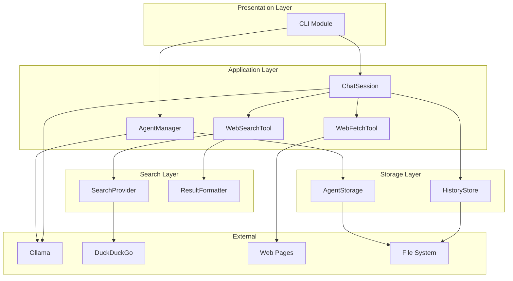

# Design Document: Web Search Feature

## Overview

This feature extends Offline Chat to enable AI agents to search the web for current information using Ollama's tool calling capabilities. The design integrates with the existing architecture by adding a new `WebSearchTool` component and extending `ChatSession` to support an agent loop pattern for tool execution.

The implementation uses the `duckduckgo-search` library for privacy-respecting web searches and follows Ollama's tool calling protocol for seamless integration with compatible models (e.g., Llama 3.1, Qwen3).

## Architecture



### Component Responsibilities

- **WebSearchTool**: Defines the tool schema and orchestrates search execution
- **WebFetchTool**: Fetches and parses web page content from URLs
- **SearchProvider**: Executes searches using duckduckgo-search library
- **ResultFormatter**: Formats search results for model consumption
- **ChatSession (extended)**: Implements agent loop for tool calling

## Components and Interfaces

### SearchResult Dataclass

```python
from dataclasses import dataclass

@dataclass
class SearchResult:
    """Represents a single search result."""
    title: str
    href: str
    body: str
    
    def to_dict(self) -> dict[str, str]:
        """Serialize to dictionary."""
        return {
            "title": self.title,
            "href": self.href,
            "body": self.body
        }
```

### SearchProvider Interface

```python
from typing import Protocol

class SearchProviderProtocol(Protocol):
    """Protocol for search provider implementations."""
    
    def search(self, query: str, max_results: int = 5) -> list[SearchResult]:
        """Execute a search and return results.
        
        Args:
            query: The search query string.
            max_results: Maximum number of results to return.
            
        Returns:
            List of SearchResult objects.
            
        Raises:
            SearchTimeoutError: If the search times out.
            SearchConnectionError: If the provider is unavailable.
        """
        ...
```

### DuckDuckGoProvider Implementation

```python
from duckduckgo_search import DDGS

class DuckDuckGoProvider:
    """Search provider using DuckDuckGo."""
    
    def __init__(self, timeout: int = 10):
        """Initialize the provider.
        
        Args:
            timeout: Request timeout in seconds.
        """
        self.timeout = timeout
    
    def search(self, query: str, max_results: int = 5) -> list[SearchResult]:
        """Execute a DuckDuckGo search.
        
        Args:
            query: The search query string.
            max_results: Maximum number of results to return.
            
        Returns:
            List of SearchResult objects.
        """
        with DDGS() as ddgs:
            results = ddgs.text(query, max_results=max_results)
            return [
                SearchResult(
                    title=r.get("title", ""),
                    href=r.get("href", ""),
                    body=r.get("body", "")
                )
                for r in results
            ]
```

### WebSearchTool Interface

```python
from typing import Any, Callable

class WebSearchTool:
    """Web search tool for Ollama tool calling."""
    
    def __init__(self, provider: SearchProviderProtocol | None = None):
        """Initialize the web search tool.
        
        Args:
            provider: Search provider instance. Defaults to DuckDuckGoProvider.
        """
        self.provider = provider or DuckDuckGoProvider()
    
    def get_tool_schema(self) -> dict[str, Any]:
        """Get the Ollama-compatible tool schema.
        
        Returns:
            Tool schema dictionary.
        """
        return {
            "type": "function",
            "function": {
                "name": "web_search",
                "description": "Search the web for current information. Use this when you need up-to-date information or facts you're not certain about.",
                "parameters": {
                    "type": "object",
                    "required": ["query"],
                    "properties": {
                        "query": {
                            "type": "string",
                            "description": "The search query"
                        },
                        "max_results": {
                            "type": "integer",
                            "description": "Maximum number of results (default: 5)",
                            "default": 5
                        }
                    }
                }
            }
        }
    
    def execute(self, query: str, max_results: int = 5) -> str:
        """Execute a web search and return formatted results.
        
        Args:
            query: The search query.
            max_results: Maximum number of results.
            
        Returns:
            Formatted search results string.
        """
        try:
            results = self.provider.search(query, max_results)
            return format_search_results(results)
        except SearchTimeoutError:
            return "Search timed out. Please try again or rephrase your query."
        except SearchConnectionError:
            return "Web search is currently unavailable. Please answer based on your existing knowledge."
        except Exception as e:
            return f"Search failed: {str(e)}. Please answer based on your existing knowledge."
```

### WebFetchTool Interface

```python
import requests
from bs4 import BeautifulSoup
from typing import Any

class WebFetchTool:
    """Web page fetching tool for Ollama tool calling."""
    
    def __init__(self, timeout: int = 10):
        """Initialize the web fetch tool.
        
        Args:
            timeout: Request timeout in seconds.
        """
        self.timeout = timeout
    
    def get_tool_schema(self) -> dict[str, Any]:
        """Get the Ollama-compatible tool schema.
        
        Returns:
            Tool schema dictionary.
        """
        return {
            "type": "function",
            "function": {
                "name": "web_fetch",
                "description": "Fetch and read the full content of a web page. Use this when you need more detail from a specific URL found in search results.",
                "parameters": {
                    "type": "object",
                    "required": ["url"],
                    "properties": {
                        "url": {
                            "type": "string",
                            "description": "The URL of the web page to fetch"
                        },
                        "max_length": {
                            "type": "integer",
                            "description": "Maximum characters to return (default: 5000)",
                            "default": 5000
                        }
                    }
                }
            }
        }
    
    def execute(self, url: str, max_length: int = 5000) -> str:
        """Fetch a web page and return its text content.
        
        Args:
            url: The URL to fetch.
            max_length: Maximum characters to return.
            
        Returns:
            Extracted text content from the page.
        """
        try:
            # Validate URL
            if not url.startswith(('http://', 'https://')):
                return f"Invalid URL: {url}. URL must start with http:// or https://"
            
            # Fetch the page
            response = requests.get(
                url,
                timeout=self.timeout,
                headers={'User-Agent': 'Mozilla/5.0 (compatible; OfflineChat/1.0)'}
            )
            response.raise_for_status()
            
            # Parse and extract text
            soup = BeautifulSoup(response.text, 'html.parser')
            
            # Remove unwanted elements
            for element in soup(['script', 'style', 'nav', 'header', 'footer', 'aside']):
                element.decompose()
            
            # Extract text
            text = soup.get_text(separator='\n', strip=True)
            
            # Truncate if needed
            if len(text) > max_length:
                text = text[:max_length] + "\n\n[Content truncated...]"
            
            return text if text else "No readable content found on this page."
            
        except requests.Timeout:
            return f"Page fetch timed out after {self.timeout} seconds."
        except requests.HTTPError as e:
            return f"HTTP error {e.response.status_code} when fetching {url}"
        except requests.RequestException as e:
            return f"Failed to fetch page: {str(e)}"
        except Exception as e:
            return f"Error parsing page content: {str(e)}"
```

### ResultFormatter Function

```python
def format_search_results(results: list[SearchResult]) -> str:
    """Format search results for model consumption.
    
    Args:
        results: List of SearchResult objects.
        
    Returns:
        Formatted string with numbered results.
    """
    if not results:
        return "No search results found for this query."
    
    formatted = []
    for i, result in enumerate(results, 1):
        # Truncate body to keep results concise
        body = result.body[:200] + "..." if len(result.body) > 200 else result.body
        formatted.append(
            f"{i}. {result.title}\n"
            f"   URL: {result.href}\n"
            f"   {body}"
        )
    
    return "\n\n".join(formatted)
```

### Extended Agent Dataclass

```python
@dataclass
class Agent:
    """Represents an AI agent configuration."""
    name: str
    display_name: str
    base_model: str
    system_prompt: str
    temperature: float = 0.7
    language: str = "English"
    web_search_enabled: bool = False  # NEW FIELD
    created_at: datetime = field(default_factory=datetime.now)
    
    def to_dict(self) -> dict[str, Any]:
        """Serialize agent to dictionary."""
        return {
            "name": self.name,
            "display_name": self.display_name,
            "base_model": self.base_model,
            "system_prompt": self.system_prompt,
            "temperature": self.temperature,
            "language": self.language,
            "web_search_enabled": self.web_search_enabled,  # NEW
            "created_at": self.created_at.isoformat()
        }
    
    @classmethod
    def from_dict(cls, data: dict[str, Any]) -> "Agent":
        """Deserialize agent from dictionary."""
        return cls(
            name=data["name"],
            display_name=data["display_name"],
            base_model=data["base_model"],
            system_prompt=data["system_prompt"],
            temperature=data.get("temperature", 0.7),
            language=data.get("language", "English"),
            web_search_enabled=data.get("web_search_enabled", False),  # NEW
            created_at=datetime.fromisoformat(data["created_at"])
        )
```

### Extended ChatSession with Agent Loop

```python
class ChatSession:
    """Manages a chat session with an AI agent."""
    
    def __init__(
        self,
        manager: AgentManager,
        history_store: Optional[HistoryStore] = None,
        tools: Optional[list] = None,
    ):
        """Initialize the ChatSession.
        
        Args:
            manager: AgentManager instance.
            history_store: Optional HistoryStore instance.
            tools: Optional list of tools to use regardless of agent config.
        """
        self.manager = manager
        self.history_store = history_store or manager.history_store
        self.custom_tools = tools
        self.agent: Optional[Agent] = None
        self.history: Optional[ConversationHistory] = None
        self._web_search_tool: Optional[WebSearchTool] = None
        self._web_fetch_tool: Optional[WebFetchTool] = None
        self._on_tool_call: Optional[Callable[[str], None]] = None
    
    def set_tool_callback(self, callback: Callable[[str], None]) -> None:
        """Set callback for tool call notifications.
        
        Args:
            callback: Function called with tool name when a tool is invoked.
        """
        self._on_tool_call = callback
    
    def _get_tools(self) -> list[dict[str, Any]]:
        """Get tools to register with Ollama.
        
        Returns:
            List of tool schemas, empty if web search not enabled.
        """
        if self.custom_tools:
            return [t.get_tool_schema() for t in self.custom_tools]
        
        if self.agent and self.agent.web_search_enabled:
            if self._web_search_tool is None:
                self._web_search_tool = WebSearchTool()
            if self._web_fetch_tool is None:
                self._web_fetch_tool = WebFetchTool()
            return [
                self._web_search_tool.get_tool_schema(),
                self._web_fetch_tool.get_tool_schema()
            ]
        
        return []
    
    def _execute_tool(self, name: str, arguments: dict[str, Any]) -> str:
        """Execute a tool by name.
        
        Args:
            name: Tool name.
            arguments: Tool arguments.
            
        Returns:
            Tool execution result.
        """
        if self._on_tool_call:
            self._on_tool_call(name)
        
        if name == "web_search":
            tool = self._web_search_tool or WebSearchTool()
            return tool.execute(**arguments)
        elif name == "web_fetch":
            tool = self._web_fetch_tool or WebFetchTool()
            return tool.execute(**arguments)
        
        return f"Unknown tool: {name}"
    
    def send_message(self, content: str) -> Iterator[str]:
        """Send a message and yield response chunks.
        
        Implements agent loop for tool calling.
        """
        if self.agent is None or self.history is None:
            raise RuntimeError("No active session. Call start() first.")
        
        # Append user message to history
        user_message = Message(
            role="user",
            content=content,
            timestamp=datetime.now(),
        )
        self.history.messages.append(user_message)
        
        # Build messages for Ollama
        messages = [{"role": "system", "content": self.agent.system_prompt}]
        messages.extend(
            {"role": msg.role, "content": msg.content}
            for msg in self.history.messages
        )
        
        tools = self._get_tools()
        
        # Agent loop - continue until no more tool calls
        while True:
            try:
                if tools:
                    response = ollama.chat(
                        model=self.agent.name,
                        messages=messages,
                        tools=tools,
                        stream=False,  # Non-streaming for tool calls
                    )
                else:
                    # No tools - use streaming
                    yield from self._stream_response(messages)
                    return
                
                message = response.get("message", {})
                tool_calls = message.get("tool_calls", [])
                
                if not tool_calls:
                    # No tool calls - stream final response
                    content = message.get("content", "")
                    if content:
                        # Append to messages for context
                        messages.append({"role": "assistant", "content": content})
                        # Stream the response
                        for char in content:
                            yield char
                        # Save to history
                        self.history.messages.append(Message(
                            role="assistant",
                            content=content,
                            timestamp=datetime.now(),
                        ))
                    return
                
                # Execute tool calls
                messages.append(message)  # Add assistant message with tool calls
                
                for call in tool_calls:
                    func = call.get("function", {})
                    name = func.get("name", "")
                    args = func.get("arguments", {})
                    
                    result = self._execute_tool(name, args)
                    
                    # Add tool result to messages (not to history)
                    messages.append({
                        "role": "tool",
                        "tool_name": name,
                        "content": result
                    })
                
            except Exception as e:
                error_str = str(e).lower()
                if "connection" in error_str or "refused" in error_str:
                    raise OllamaConnectionError()
                raise
    
    def _stream_response(self, messages: list[dict]) -> Iterator[str]:
        """Stream response without tools.
        
        Args:
            messages: Messages to send to Ollama.
            
        Yields:
            Response chunks.
        """
        stream = ollama.chat(
            model=self.agent.name,
            messages=messages,
            stream=True,
        )
        
        full_response = ""
        for chunk in stream:
            chunk_content = chunk.get("message", {}).get("content", "")
            full_response += chunk_content
            yield chunk_content
        
        self.history.messages.append(Message(
            role="assistant",
            content=full_response,
            timestamp=datetime.now(),
        ))
```

### Custom Exceptions

```python
class SearchError(OfflineChatError):
    """Base exception for search errors."""
    pass

class SearchTimeoutError(SearchError):
    """Raised when a search times out."""
    def __init__(self, timeout: int):
        self.timeout = timeout
        super().__init__(f"Search timed out after {timeout} seconds.")

class SearchConnectionError(SearchError):
    """Raised when the search provider is unavailable."""
    def __init__(self):
        super().__init__("Cannot connect to search provider.")
```

## Data Models

### Extended Agent Configuration (config.json)

```json
{
  "name": "research-assistant",
  "display_name": "Research Assistant",
  "base_model": "llama3.1:latest",
  "system_prompt": "You are a helpful research assistant. When asked about current events or facts you're unsure about, use web search to find accurate information. Always cite your sources.",
  "temperature": 0.7,
  "language": "English",
  "web_search_enabled": true,
  "created_at": "2025-01-13T10:00:00Z"
}
```

### Tool Schema Format

```json
{
  "type": "function",
  "function": {
    "name": "web_search",
    "description": "Search the web for current information.",
    "parameters": {
      "type": "object",
      "required": ["query"],
      "properties": {
        "query": {
          "type": "string",
          "description": "The search query"
        },
        "max_results": {
          "type": "integer",
          "description": "Maximum number of results",
          "default": 5
        }
      }
    }
  }
}
```

## Correctness Properties

*A property is a characteristic or behavior that should hold true across all valid executions of a system—essentially, a formal statement about what the system should do. Properties serve as the bridge between human-readable specifications and machine-verifiable correctness guarantees.*

### Property 1: Tool Schema Validity

*For any* WebSearchTool instance, the generated tool schema SHALL be a valid dictionary containing "type" set to "function", a "function" object with "name", "description", and "parameters" fields, where parameters includes "query" as a required string property.

**Validates: Requirements 1.1, 1.2, 1.3**

### Property 2: Search Result Structure

*For any* successful search execution, each result in the returned list SHALL contain non-null "title", "href", and "body" string fields.

**Validates: Requirements 1.5, 2.4**

### Property 3: Agent Serialization Round-Trip (Extended)

*For any* valid Agent object with web_search_enabled set to either True or False, serializing it to dictionary (to_dict) and then deserializing (from_dict) SHALL produce an equivalent Agent object with all fields preserved, including web_search_enabled.

**Validates: Requirements 4.5**

### Property 4: Tool Registration Based on Configuration

*For any* Agent with web_search_enabled=True, starting a ChatSession SHALL result in tools being registered with Ollama. *For any* Agent with web_search_enabled=False, starting a ChatSession SHALL result in no tools being registered.

**Validates: Requirements 3.1, 4.3, 4.4**

### Property 5: History Persistence Excludes Tool Messages

*For any* conversation that includes tool calls, after the session ends and history is saved, the persisted history SHALL contain only user messages and final assistant responses, with no tool call or tool result messages.

**Validates: Requirements 3.6, 3.7**

### Property 6: Search Result Formatting

*For any* non-empty list of SearchResult objects, the formatted output SHALL contain numbered entries (1., 2., etc.), and each entry SHALL include the result's title and href.

**Validates: Requirements 5.1, 5.3**

### Property 7: Agent Loop Termination

*For any* conversation with a web-search-enabled agent, the agent loop SHALL terminate when the model returns a response without tool calls, and the final response SHALL be yielded to the caller.

**Validates: Requirements 3.4, 3.5**

### Property 8: Web Fetch Tool Schema Validity

*For any* WebFetchTool instance, the generated tool schema SHALL be a valid dictionary containing "type" set to "function", a "function" object with "name" set to "web_fetch", "description", and "parameters" fields, where parameters includes "url" as a required string property.

**Validates: Requirements 9.1, 9.2, 9.3**

### Property 9: Web Fetch Content Extraction

*For any* valid HTML page content, the WebFetchTool SHALL extract text content with script, style, nav, header, footer, and aside elements removed, and the result SHALL be truncated to max_length characters if exceeded.

**Validates: Requirements 9.5, 9.6, 9.7**

## Error Handling

### Search-Specific Exceptions

| Exception | Trigger | User-Facing Message |
|-----------|---------|---------------------|
| SearchTimeoutError | Search exceeds timeout | "Search timed out. Please try again." |
| SearchConnectionError | Provider unreachable | "Web search is currently unavailable." |
| SearchError | Generic search failure | "Search failed: {details}" |

### Error Recovery Strategy

1. **Search Timeout**: Return timeout message to model, allow it to answer from knowledge
2. **Connection Error**: Return unavailable message to model, allow it to answer from knowledge
3. **Unexpected Error**: Log error, return generic failure message to model
4. **Ollama Error**: Propagate existing OllamaConnectionError

## Testing Strategy

### Testing Framework

- **Unit Testing**: pytest
- **Property-Based Testing**: hypothesis
- **Mocking**: unittest.mock for external services
- **Test Configuration**: Minimum 100 iterations per property test

### Test Structure

```
tests/
├── test_search_provider.py    # SearchProvider tests
├── test_web_search_tool.py    # WebSearchTool tests
├── test_result_formatter.py   # Formatting tests
├── test_session_tools.py      # ChatSession tool calling tests
└── test_agent_extended.py     # Extended Agent tests
```

### Mocking Strategy

- **DuckDuckGo API**: Mock DDGS class for unit tests
- **Ollama**: Mock ollama.chat for tool calling tests
- **Property tests**: Use real implementations where possible, mock external services

### Test Categories

| Category | Test Type | Coverage |
|----------|-----------|----------|
| Tool schema validity | Property | All WebSearchTool instances |
| Search result structure | Property | All search results |
| Agent serialization | Property | All Agent objects with web_search_enabled |
| Tool registration | Property | All agent configurations |
| History persistence | Property | All tool-using conversations |
| Result formatting | Property | All result lists |
| Agent loop termination | Property | All tool-calling conversations |
| Error handling | Unit | Timeout, connection, generic errors |
| CLI indicators | Unit | Search indicator display |
